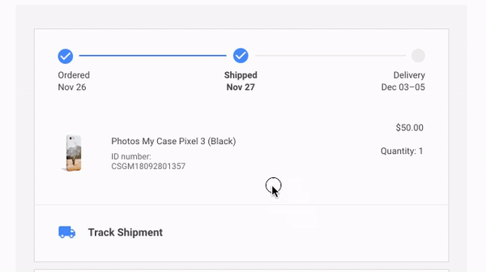

+++
title = "Following a phone case"
date = "2018-11-19T20:13:11-04:00"
author = "Bill Morris"
authorTwitter = "" #do not include @
cover = ""
tags = []
keywords = ["tech", "manufacturing", "china", "google"]
description = "A good old-fashioned ridealong through the global supply chain."
showFullContent = false
readingTime = false
hideComments = false
color = "" #color from the theme settings
+++

On CyberMonday I ordered one of those custom-printed phone case thingies because Google ran a hard sell. Can't wait!

Hmmm . . . looks like it shipped. Lemme check the status. 

Holy hell, it's a map! It shows where my phone case is!

Looks like it's currently in . . . Shenzhen! Sweet! This is already a clearer window into the supply chain than what I'm accustomed to . . .

Oh man, it must be at one of those massive factories I've been obliquely-misinformed about since I was 5. Let's take a look.

