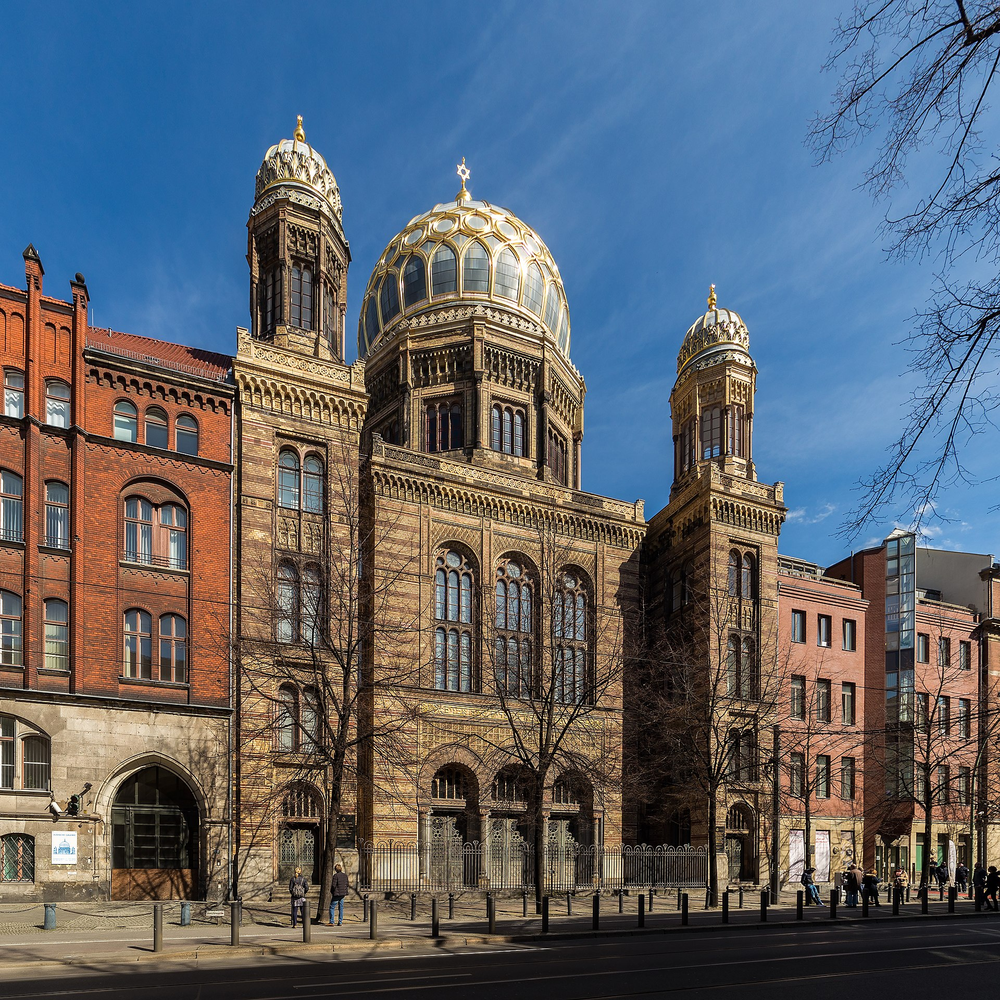

+++
title = "Otto and Eugene"
date = "2021-01-10T18:17:00-04:00"
author = "Bill Morris"
authorTwitter = "" #do not include @
cover = "images/goodman.jpeg"
tags = []
keywords = ["history", "fascism", "nazis", "jan 6th"]
description = ""
showFullContent = false
readingTime = false
hideComments = false
color = "" #color from the theme settings
+++

_Officer Eugene Goodman receiving the Joint Meritorious Civilian Service Award, photo by Navy Petty Officer 1st Class Carlos M. Vazquez II_

On November 9, 1938, Goebbels turned the SA loose on Jewish communities throughout Germany, in a pogrom now known as Kristallnacht. With the veneer of a "popular, spontaneous uprising", nazis smashed Jewish business, attacked Jews, and arrested them in the thousands, heralding the horrors to come.

1400 Synagogues were burned or broken.

In Berlin, the New Synagogue was similarly attacked that night. The SA forced the locals out and began to light fires as a crowd gathered.

_["The Synagogue on Oranienburger Strasse, Berlin", by Emile Pierre Joseph De Cauwer](https://commons.wikimedia.org/wiki/File:Berlin_Neue_Synagoge_%C3%96l_auf_Leinwand_Emil_de_Cauwer_1865.jpg)_

At this point, Lieutenant Otto Bellgardt of the local precinct's police force arrived and somehow (possibly at gunpoint) forced the SA back. He then directed the fire brigade (on the scene to keep the fire off of neighboring houses) to extinguish the blazes in the Synagogue.

(The story is muddled here - accounts suggest that Bellgardt's superior Wilhelm Krützfeld was either on the scene as well, or directing the rescue effort remotely. Some accounts [are available in German](https://www.google.com/books/edition/Ost_Berlin/Z6WIDwAAQBAJ?hl=en&gbpv=1&dq=%22otto%20bellgardt%22&pg=PA94&printsec=frontcover&bsq=%22otto%20bellgardt%22)).

Bellgardt's act - by most interpretations, of doing his job - saved that German Synagogue on a night when very few of them were spared, and it was used by the congregation for at least a few more years before the congregation was evicted completely. Reports that I have difficulty confirming have him and his colleagues repeatedly defying the gestapo in subsequent years, warning Jews of raids and forging papers on their behalf.

Legends grow in the telling, but the New Synagogue is still there today. 

_Photo by Ansgar Koreng_

I've occasionally thought of Bellgardt over the past few years, while American fascism - wrapped in the historically ever-present cloak of white supremacy - has lurched up from the depths.

> I've wondered what's required to have courage in the face of fascists.

Perhaps it's some exceptional bravery and foresight, to know what's morally correct and to position yourself in its defense. I think of Rosa Parks in this category. Lewis Grassrope. Heather Heyer. But maybe it's also just an ability to do your job when it counts. Bellgardt did his job on a night when police looked the other way. Eugene Goodman [did his job last Wednesday](https://www.reuters.com/article/us-usa-trump-capitol-police-officer/police-officer-hailed-for-steering-capitol-mob-from-senate-chamber-idUSKBN29F0N7) while at least some of his colleagues looked the other way.

Police are hit by crosswinds in these cases: a natural fit with the "order" of fascism, but with a charge to protect their communities above all. Our country (or at least those of us slow to wake) has felt this tension more than usual this past year. I don't expect that Officer Goodman is the only hero whose story will emerge from last week's events, but it echoes with Bellgardt's act. And I wonder, again . . .

> When any of us have a job that requires courage, and the winds are blowing against us, what will we do?
