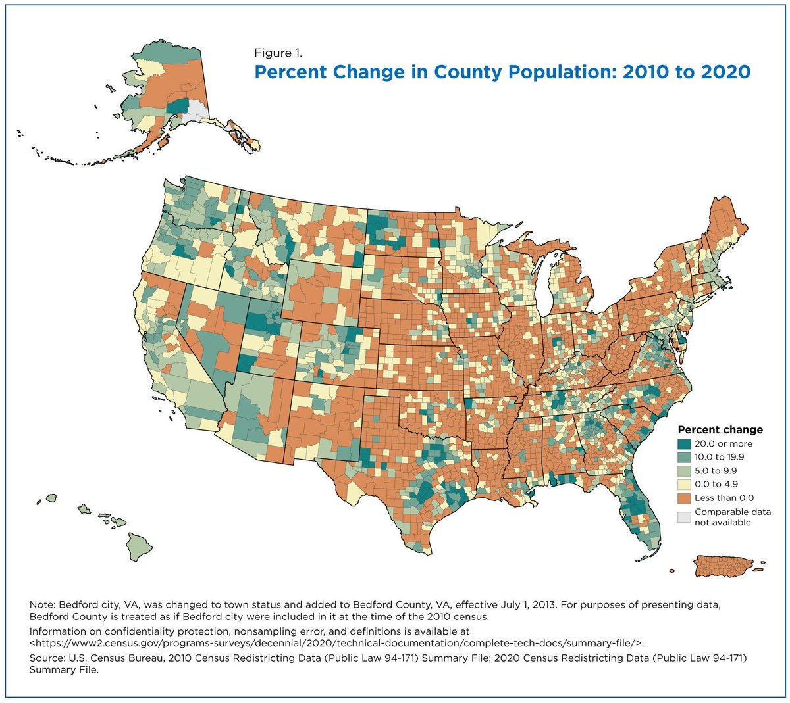
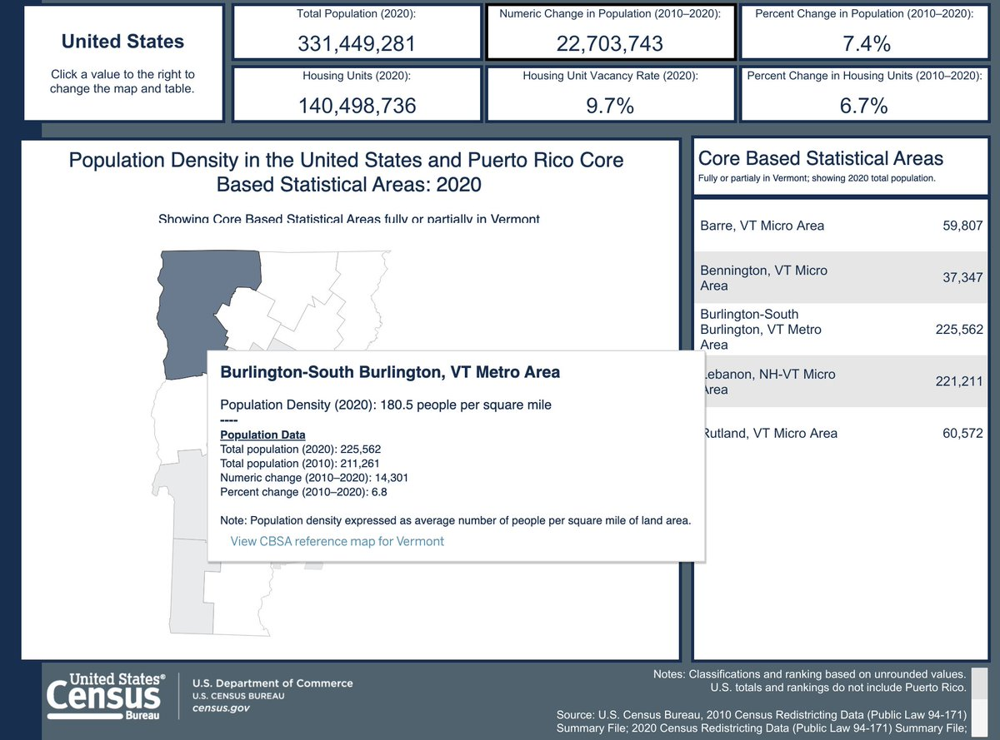
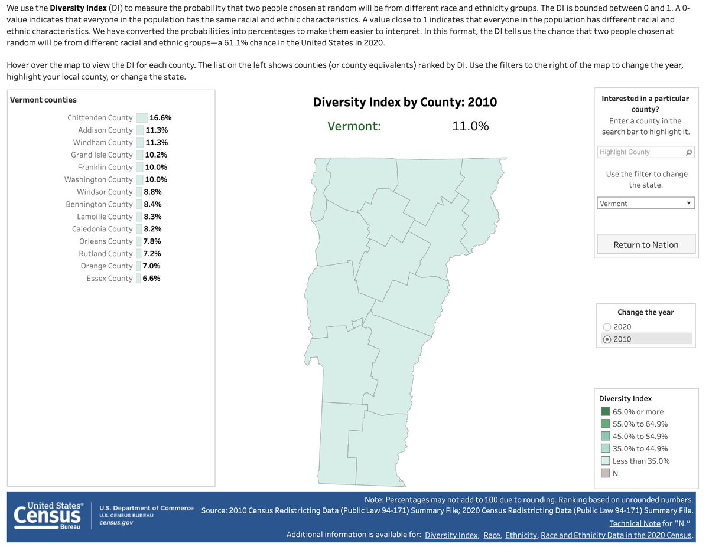
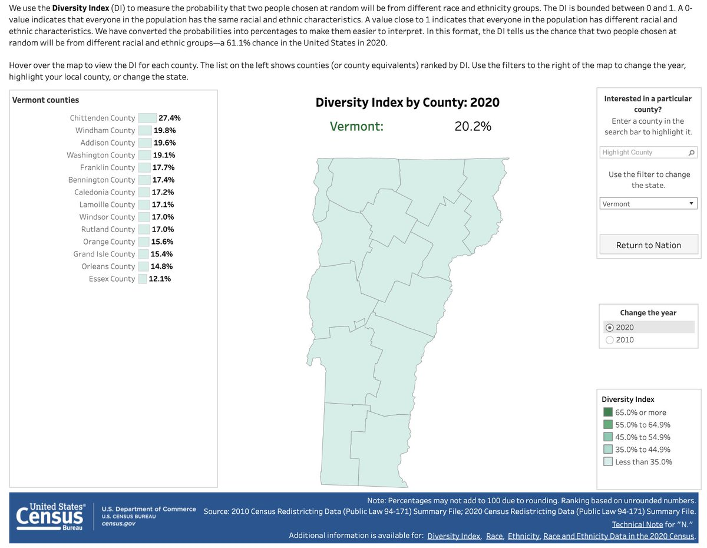

+++
title = "2020 Census drop, yo."
date = "2021-08-12T17:50:32-04:00"
author = ""
authorTwitter = "" #do not include @
cover = "images/cover.jpeg"
tags = []
keywords = ["census", "population", "vermont", "statistics"]
description = "A look at the implications in the Green Mountains."
showFullContent = false
readingTime = false
hideComments = false
color = "" #color from the theme settings
+++

_[Photo](https://catalog.archives.gov/id/207899869) via the National Archives: Fairlington, VA. A census enumerator getting data from a Virginia housewife for the 1950 Census._

The 2020 numbers are in! Let's take a look at the changes since 2010, Vermont-centric . . .

Metros grew, but [half of counties shrank](https://www.census.gov/library/stories/2021/08/more-than-half-of-united-states-counties-were-smaller-in-2020-than-in-2010.html) (including 3 in VT, 👀 on Rutland) 

The Burlington, VT metro [grew at about the same rate as NYC](https://www.census.gov/library/visualizations/interactive/2020-population-and-housing-state-data.html): __just under 7%__, which is respectable but looks sclerotic compared to Atlanta or Houston. (And in #btv's case it's ~15k new folks; NYC picked up 1.2 million)

Vermont went from being "monolithically white" to "overwhelmingly white", with Chittenden county's nonwhite population cracking double-digits of percentage. 

[Vermont got older [again]](https://www.census.gov/library/visualizations/interactive/adult-and-under-the-age-of-18-populations-2020-census.html). The proportion of the population under 18 shrank in every county (though there are likely some municipalities and subdivisions where that's not the case).

In some cases (Essex county) it looks like the age proportion change should have inverted, but that's offset by overall population loss. An aging population remains Vermont's existential problem.

Bonus note: [redistricting will get underway now](https://www.census.gov/programs-surveys/decennial-census/about/rdo/summary-files.html)! Folks have really just been waiting on today's data. Since Vermont is . . . tiny, this means legislative and municipal reapportionment will begin, not congressional-level (we still only get the one rep). While the various parties will be sharpening their pencils/knives/maptitude licenses, the participatory redistricting toolsets [are already being updated](https://twitter.com/DistrictBuilder/status/1425804697210863620).

Many thanks to all the folks at US Census Bureau for making the best of it despite cascades of political pressure and a literal plague. We appreciate what you've done.

