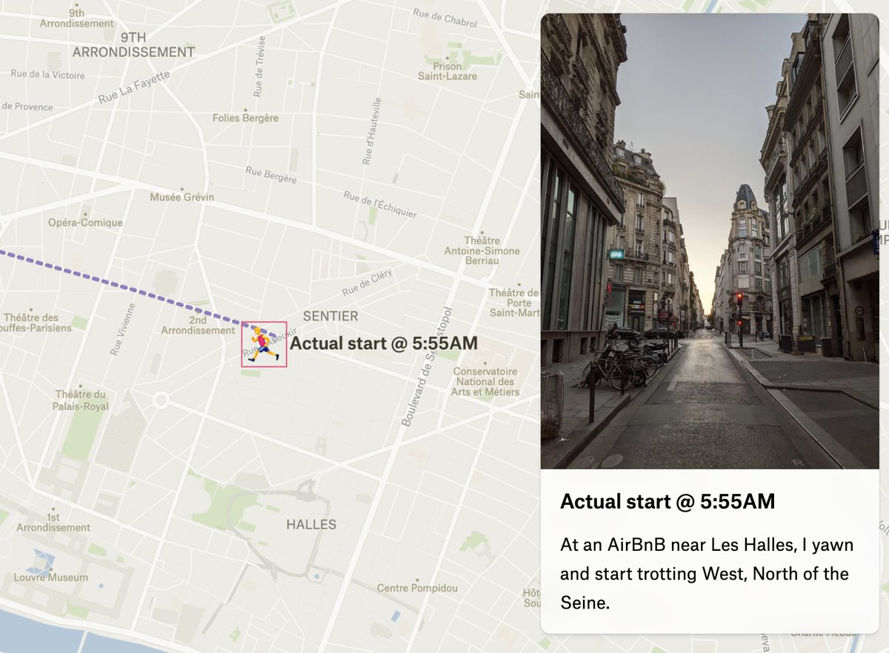
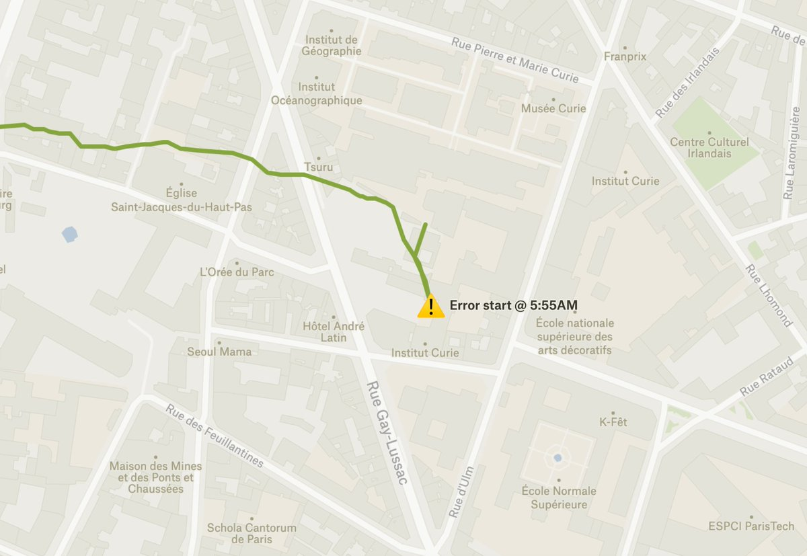
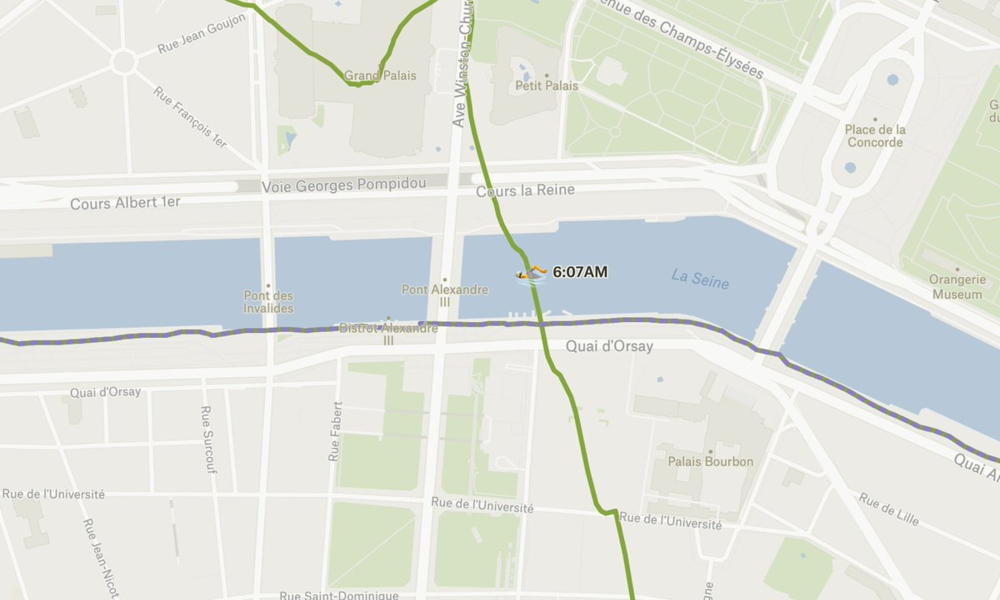
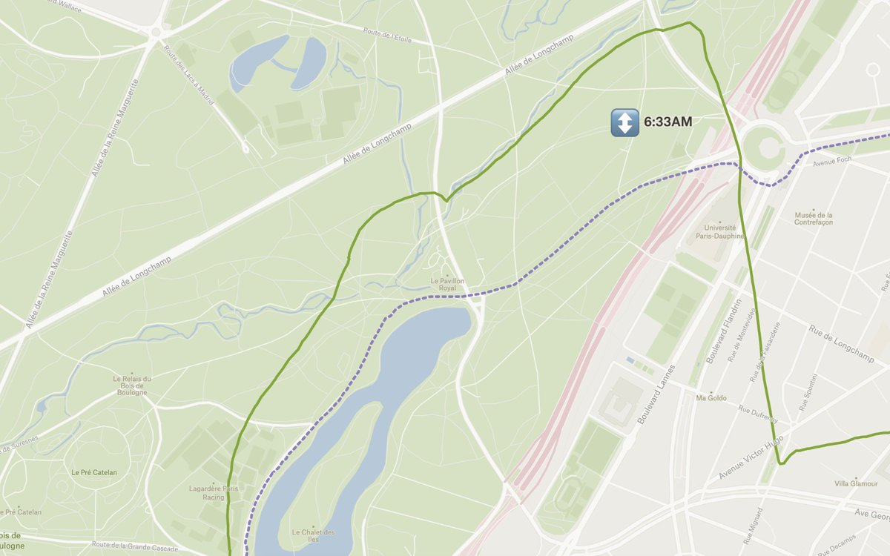
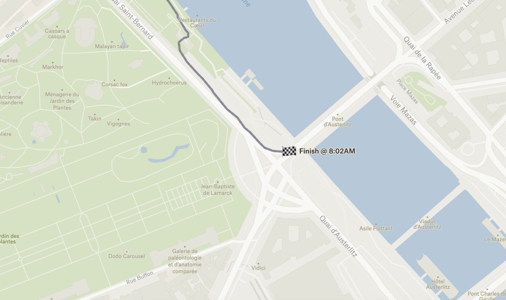

+++
title = "Adventures of a smartwatch in Paris [UPDATE: MYSTERY SOLVED]"
date = "2022-10-10T10:31:42-04:00"
author = "Bill Morris"
authorTwitter = "" #do not include @
cover = "images/cover.jpg"
tags = []
keywords = ["gps", "running", "garmin", "travel", "paris"]
description = "In which I learn a thing or two about novel GPS errors."
showFullContent = false
readingTime = false
hideComments = false
color = "" #color from the theme settings
+++
_Follow along using [this map made with Felt](https://felt.com/map/A-Run-Through-Paris-July-3-2022-yU8I1K9CARgy6XKOraks4YA)_

One day this past July, I got up early and started a long run around Paris. I've found this practice to be the easiest way to explore without being an insufferable tourist. As I usually do, I started tracking the run with my [Garmin Forerunner 245 watch](https://www.garmin.com/en-US/p/628939).

My watch, unbeknownst to me, decided that I was actually starting 3km South, near the Institut Curie.

My actual feet carried me through empty streets to the Palais Garnier, at the first sign of the sunrise.

My watch, meanwhile, was barging directly through the Ministry of Agriculture before leaping into the Seine, despite the convenient Pont Alexandre III nearby. 

My real self ran abruptly into a passel of Gendarmerie armed with automatic weapons in front of the Palais de l'Élysée. They grumpily directed me to a detour. Then, as I turned onto the Champs Élysées, some happy drunks - exiting a club after last call - joined me for a few blocks of jogging. (Mes amis, share that group selfie if you see this!)

This must have been too much excitement for my watch, which until now had been approaching my true location. It took a hard left and started some wild evasion patterns, again caring not a whit for the sanctity of private property. 

As I entered the Bois de Boulogne, my watch made a Northward leap and began a track that now seemed merely *offset* from my real path, like a more-familiar GPS error. 

This offset diminished steadily, until my watch finally decided to join me at the Southern end of Lac Supérieur. It stayed credibly on my wrist for the rest of the run, now mostly along the South bank of the Seine, until I called a halt past the Île Saint-Louis and staggered off to find a scooter I could take back to the apartment.

So . . . what the hell happened here? I have a GPS track that looks like it was attached to a pigeon for the first half of my run, then it was perfectly accurate for the second half. I'm familiar with GPS error, from all the way back in the Selective Availability days when DGPS was essential, to the modern era where our pocket-carried receivers can be temperamental over brief periods of time.

But I've never seen this before (or since).

Also:

- My phone seems unaffected; photo locations in the same time window are accurate.
- I paused logging for a few minutes just after the convergence point while I looked for an exit from the park.
- I manually added the "corrected" track from memory. It's not bulletproof.

I've only got two hypotheses:

1. The watch was having a bad day, and Garmin postprocessing filled in the gaps between wild jumps until the signal locked in.
2. The French State (or someone else) was systematically spoofing all over Paris until about 7AM.

I would *love* to hear your suspicions as well . . .

## [UPDATE, 10/13]

A solution has arisen, provided by [John Wiseman](https://twitter.com/lemonodor): 

For a week this summer - including my day - a bunch of Sony-made GPS chipsets [had a bug that made them look in the wrong parts of the sky for satellites.](https://www.dcrainmaker.com/2022/07/gps-accuracy-issue-impacted-garmin-suunto-and-polar-watches-over-past-week.html). I was able to get that diagnosis confirmed y Garmin support:

> The issue in the blog was almost certainly the cause. The issue with that particular EPO file was that was entirely wrong, so satellite acquisition was completely thrown off. Normally, if the EPO file is just old, a GPS lock can take a few minutes. In this case, it may have taken minutes to hours, or it may not have locked on at all. Similar to the delay that happens when you try to acquire GPS after traveling a long distance. 

All's well that ends well, and apparently spoofing had nothing to do with it!

