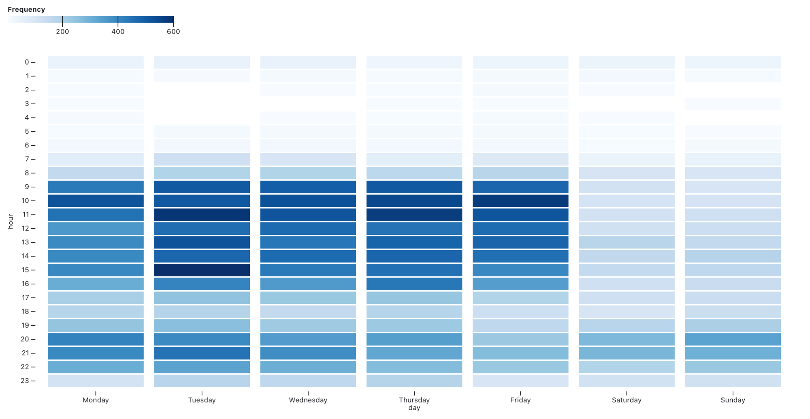

+++
title = "Migrating with tusks and a trunk"
date = "2022-11-13T17:35:10-04:00"
author = "Bill Morris"
authorTwitter = "" #do not include @
cover = "images/mastodon.jpeg"
tags = []
keywords = ["twitter", "mastodon", "social media", "blog"]
description = ""
showFullContent = false
readingTime = false
hideComments = false
color = "" #color from the theme settings
+++

Y'all.

I've wandered over to Mastodon from Twitter, along with a goodly number of other folks from the broad geo-sphere, and it's . . . nice. Feel easier to post random musings. Less motive, less image. But I rolled back over to Twitter right quick when I wanted to get into the discussion over [a Sunday NYT article about my tiny-ass Vermont city](https://www.nytimes.com/2022/11/12/business/burlington-police-stolen-bikes.html). I have certain communities in my feed, and the #btv folks are still mostly there.

The latest drama is not the first time I've considered quitting Twitter altogether. Hell, I probably have another thread exactly like this one from 2016 over there that I've long since forgotten about. But I finally decided to look at my involvement holistically.

With my complete archive since 2011 in view, I found that I've actually been steadily retreating from Twitter for years now. Hard to say what I've replaced it with, but the signs of my disenchantment are clear, even as I probably remain in the top echelon of users.

I'm also pleased to see that I generally treat Twitter like work: I learn from colleagues, share things I think are cool, and stay the hell out of the office on weekends.

It may be that I spend more time on Mastodon now, but I think I'll keep receding from these spaces. Facebook is already long behind me and I don't mourn.

__I'll be reading more books and going outside. I know that sounds like a weak new years resolution, but I'm already underway.__

In any case, if you've got more than a few years on that other hellsite I strongly recommend you check out your own trajectory with [this excellent tool from Ian Johnson](https://observablehq.com/@observablehq/save-and-analyze-your-twitter-archive). Take care of yourselves, and you can find me here (as well as blogging more, apparently):

https://vis.social/@bil/109524531064591079

