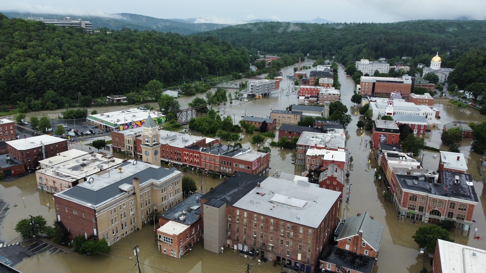

+++
title = "A beautiful summer"
date = "2023-07-12T13:56:21-04:00"
author = "Bill Morris"
authorTwitter = "" #do not include @
cover = "images/cover.jpeg"
tags = []
keywords = ["vermont", "flood", "climate"]
description = "Can tragedy fade into the background when it's on your doorstep?"
showFullContent = false
readingTime = false
hideComments = false
color = "" #color from the theme settings
+++

Summer is great.

I keep forgetting this, but the shores of Lake Champlain - for a blessed few months every year - are an absolute paradise. As I biked with my son to his summer camp this morning, I saw it in full display: boats on the water, strolling couples, picnickers, people literally pulling fragrant tree blossoms to their noses and inhaling with a smile. I took a deep breath and was grateful.

_Burlington, VT, in perfect summer form._

Ten miles away as the crow flies, the citizens of the town of Richmond were digging mud out of their basements and ground floors. They were pulling wrecked cars and downed trees out of their streets. The floodwaters had receded, but the damage will take time to undo. A great storm raked the Green Mountains for two days, dumping [previously-unknown amounts of rain](https://forecast.weather.gov/product.php?site=BTV&product=RER&issuedby=BTV) on the high ground. This swelled the streams and rivers, which duly raged over their banks and into the streets of towns and villages throughout the state. It's hard to imagine, but [it was close to being even worse](https://vtdigger.org/2023/07/11/u-s-army-corps-downgrades-flood-warning-around-ball-mountain-and-townshend-dams/).

Montpelier was flooded up to the steps of the gold-domed state capitol building, and onlookers described an eerie soundscape of fire alarms going off in every direction. This is the third time in my years of being a Vermonter that Montpelier has flooded, which I'm sure is far too often for the folks who've lived through it all.

_Montpelier as the Winooski river peaked; [photo by StoryWorkz/VTDigger](https://vtdigger.org/2023/07/11/photos-vermonts-capital-under-floodwaters/)_

On the waterfront today, I cycled past a beach club, with its stand-up paddleboards (we have no surf, you see) arranged on racks, ready for folks to take them out on the lake. Some of them were solid core, but others were the newer, inexplicably-inflatable kind that I keep meaning to get for my family. The same kind that my best friend's wife and daughter were using earlier today to raft vegetable starts to safety, away from the waist-deep water that had flooded the greenhouses on [their farm in the Northeastern part of the state](https://www.joesbrookfarm.com/). They lost a month of crops, but they're lucky among farmers; they'll have time to plant new courses of vegetables. Others have seen their last harvests for the year.

When a tragedy hits somewhere in the world, and news reaches me, there's a natural inclination to grade its impact on me by its proximity. I don't know anyone from Tigray, I've never been to Fukushima. I note it and I move on; I educate myself and maybe I donate some money. This is a defense mechanism - I know there's only so much suffering I can let into my heart before it breaks under the strain. I have limits, honed by years of international development work and volunteering.

But the corrolary of that defense mechanism is that close proximity _should have a greater impact on me._ It should move me, spur me to action.

But today, Montpelier might as well be Port au Prince. It feels as much a world away from the tranquility and protection of Burlington, only 40 miles distant.

The governor himself [put out the word](https://web.archive.org/web/20230713014153/https://governor.vermont.gov/press-release/governor-phil-scott-provides-update-states-response-catastrophic-flooding): help out on a hyper-local basis for now. We should dig out our neighbors, not put ourselves at risk - or increase the strain on the first responders - by driving through still-flooded roads on our way to help strangers. We should prepare for a bigger effort to come, and let the initial work of lifesaving proceed. I still feel a pang of guilt looking out over that distance to the retreating floodwaters.
 
I expect Montpelier will get closer soon. I'll keep my summer gratitude close in the meantime.

