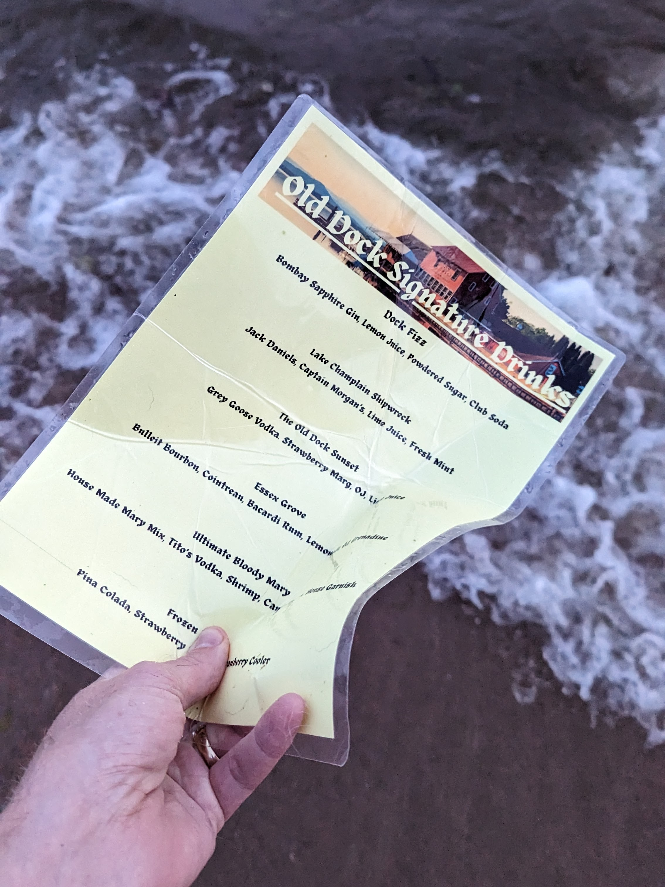
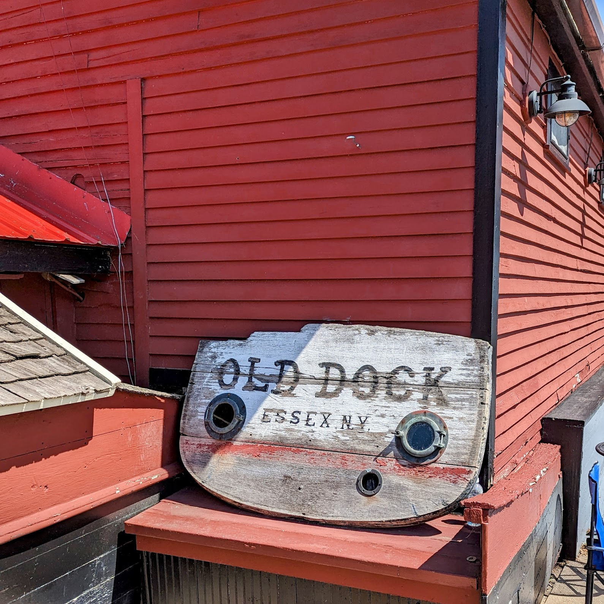
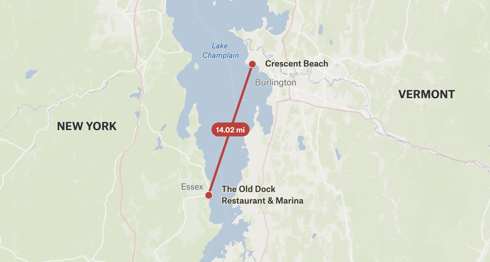
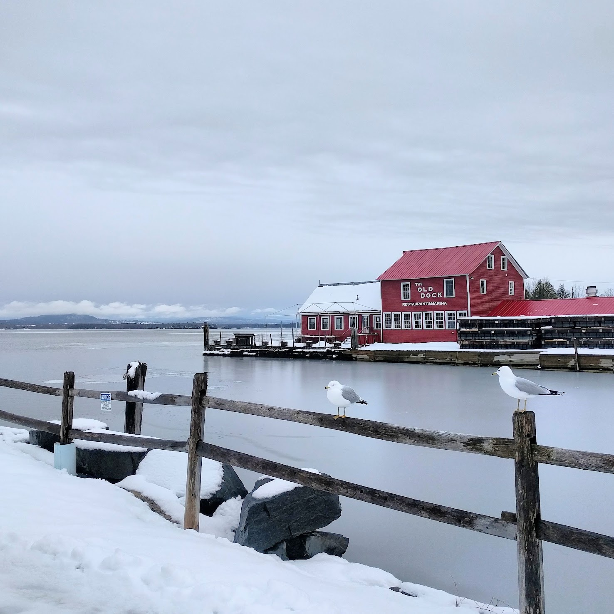

+++
title = "Tradewinds"
date = "2023-07-25T16:37:21-04:00"
author = "Bill Morris"
authorTwitter = "" #do not include @
cover = "images/cover.jpeg"
tags = []
keywords = ["maps", "champlain"]
description = "A message in a bottle (or a laminated bar menu)"
showFullContent = false
readingTime = false
hideComments = false
color = "" #color from the theme settings
+++

Yesterday a friend asked for my help hauling his boat closer to shore, along Lake Champlain in the Northern part of town. [The recent flooding elsewhere in Vermont]() had now reached the lake, and he was worried that the rising waters would carry off his summer recreation plans. So I pitched in.

Wading in at the debris-filled shore, I spotted a bright, straight-edged object in the water, and hauled it out. It was a cocktail menu!

More specifically, it was a cocktail menu from [The Old Dock](https://www.theolddockhouseonchamplain.com/), a bar I knew from long bike rides around the lake, and from ill-advised treks up I-87 as a way of getting back to Burlington from NYC. I had actually been past there in April, though they weren't open for the season yet, and the place had the weather-beaten look of a long winter endured.

The Old Dock is in Essex, on the New York side of the Southernmost ferry connection with Vermont. Essex is . . . kind of a long way from Burlington as the menu drifts. 14 miles of open water, actually. 

While I was immediately compelled by the epic journey of this lonely menu, I've also considered the possibility that it was brought over by accident in the hands of a forgetful boater after one too many of the "Dock Fizz". 

Or maybe it was a bored gull.

